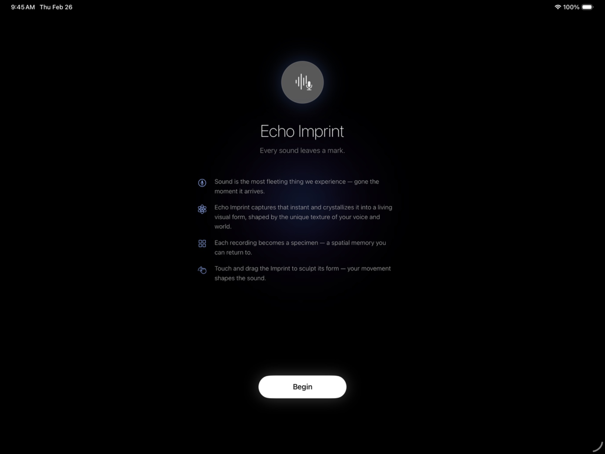
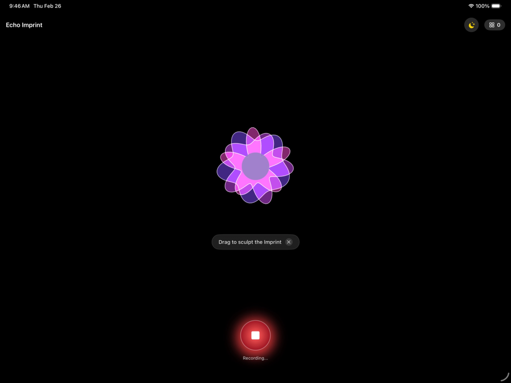
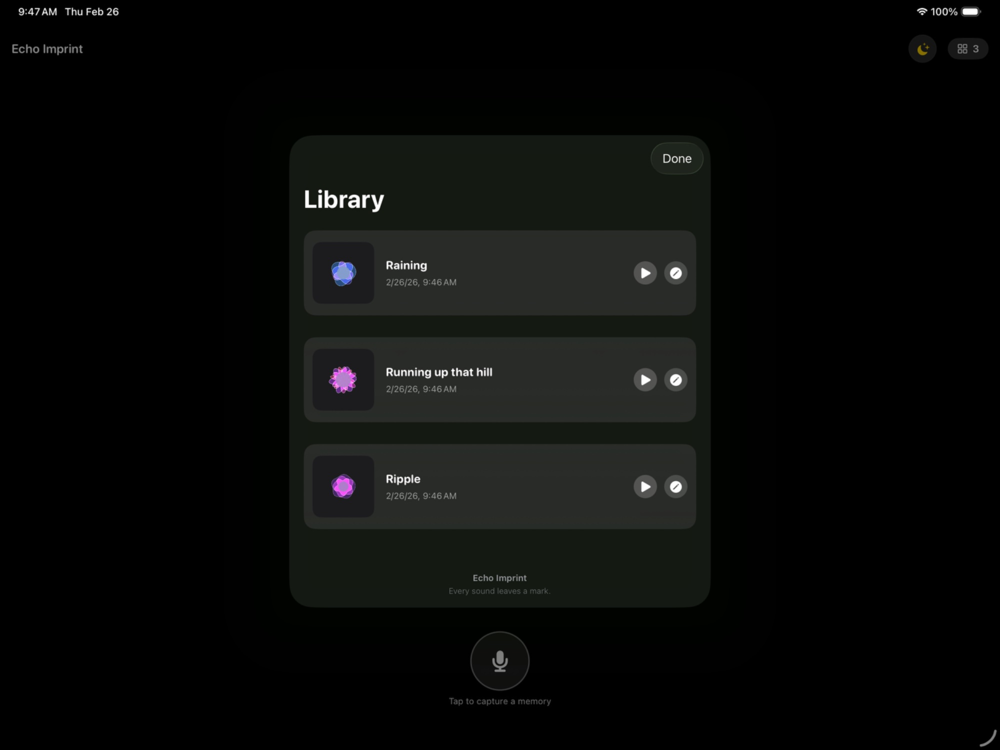

# Echo Imprint

> *Every sound leaves a mark. Watch yours come alive.*

**Swift Student Challenge 2026 Submission**

Echo Imprint transforms your acoustic environment into a living, breathing 2D organism — a specimen that grows, pulses, and morphs in real time with the sounds around you. Equal parts science, art, and accessibility tool.

---

## ✦ What It Does

Echo Imprint listens to the world through your microphone and renders each sound as a living organism on screen. The creature's shape, movement, and colour respond continuously to the frequency content and amplitude of your environment — quiet moments produce gentle undulations; loud, complex sounds cause dramatic morphological shifts.

Each session is unique. Each sound leaves an imprint.

---

## ✦ Features

### 🎙 Real-Time Audio Visualisation
Microphone input is analysed live and mapped to the organism's visual parameters — amplitude drives scale and intensity, frequency content drives shape deformation and colour hue. The result feels genuinely alive, not mechanical.

### 🎛 Drag-Gesture EQ Sculpting
Drag across the organism to reshape the frequency emphasis in real time. Low drags deepen bass response; high drags sharpen treble sensitivity. The EQ is spatial — the creature's body *is* the equaliser.

### 🗂 Specimen Library
Past sessions are preserved as named specimens. Each entry captures a snapshot of the organism's final form alongside the acoustic signature that shaped it — like pinned specimens in a herbarium, each one unrepeatable.

### ♿️ VoiceOver Accessibility
Full VoiceOver support throughout. Designed with intention: every interactive element carries a meaningful accessibility label, and the app's onboarding was written to be legible as audio-first. This feature was personal — a family member with hearing loss informed the design.

### 🌿 Onboarding Flow
A guided first-launch experience introduces the organism concept and invites the user into the space without overwhelming them. Minimal, atmospheric, and gentle.

---

## ✦ Inspiration

The visual language draws from **organic architecture** and **herbarium aesthetics** — the precise, taxonomic beauty of preserved natural specimens. Each sound-creature is treated like a discovered organism: worthy of study, preservation, and wonder.

The accessibility focus came from lived experience. Building a sound-based app that remains meaningful for someone who cannot hear it fully pushed every design decision toward intentionality.

---

## ✦ Technical Details

| | |
|---|---|
| **Platform** | iOS / iPadOS |
| **Language** | Swift |
| **Frameworks** | SwiftUI, AVFoundation, Accelerate |
| **Audio Analysis** | FFT via Accelerate framework |
| **Animation** | SwiftUI Canvas + custom geometry passes |
| **Accessibility** | VoiceOver, Dynamic Type |
| **Development Time** | ~6 days (first Swift project) |

---

## ✦ Architecture

```
EchoImprint/
├── Audio/
│   ├── AudioEngine.swift          # Microphone capture & session management
│   └── FFTProcessor.swift         # Real-time frequency analysis via Accelerate
├── Organism/
│   ├── OrganismView.swift         # SwiftUI Canvas rendering
│   ├── OrganismGeometry.swift     # Shape deformation logic
│   └── EQSculptGesture.swift      # Drag-to-EQ interaction
├── Library/
│   ├── SpecimenStore.swift        # Persistence layer
│   └── SpecimenCardView.swift     # Library UI
├── Onboarding/
│   └── OnboardingFlow.swift       # First-launch guided experience
└── App/
    └── EchoImprintApp.swift
```

---

## ✦ Accessibility Statement

Echo Imprint was designed with the belief that a sound-responsive experience should not exclude people with hearing differences. VoiceOver narrates the organism's state using descriptive language — shape, energy, intensity — so that the experience can be imagined and felt even without hearing the source audio. This was not an afterthought; it was a founding constraint.

---

## ✦ Screenshots

| Onboarding | Main Screen | Library |
|:---:|:---:|:---:|
|  |  |  |
| *Onboarding flow* | *Organism responding to sound* | *Specimen Library* |

---

## ✦ About

Made for **Apple Swift Student Challenge 2026**.  
First Swift project. Built in about six days. Made with curiosity, care, and a lot of AVFoundation documentation.

---

*Sound is transient. Echo Imprint makes it stay.*

---
---

# 📖 使用指南 · Usage Guide

> 选择语言 · 選擇語言 · Choose Language · Choisir la langue
>
> [简体中文](#-使用指南简体中文) · [繁體中文](#-使用指南繁體中文) · [English](#-usage-guide-english) · [Français](#-guide-dutilisation-français)

---

## 🇨🇳 使用指南（简体中文）

### 系统要求

- iPhone 或 iPad，运行 iOS / iPadOS 16 或更高版本
- 需要麦克风权限（首次启动时会弹出授权请求）
- 在 Xcode 15+ 中通过 Swift Playgrounds 或直接运行 `.swiftpm` 文件

---

### 第一步：启动与权限授权

打开 App 后，系统会请求麦克风访问权限。请点击**允许**——这是 Echo Imprint 运行的核心权限，没有麦克风输入，生物体将无法响应声音。

> 💡 若不慎拒绝，可前往「设置 → 隐私与安全性 → 麦克风」重新开启。


*↑ 首次启动时的引导界面*

---

### 第二步：引导流程（Onboarding）

首次启动时，App 会展示一段简短的引导流程，介绍生物体的概念与基本交互方式。按照屏幕提示轻触即可逐步推进，引导结束后将直接进入主界面。

> 💡 引导流程仅在首次安装后出现。若想重新查看，可在设置中重置引导状态。


*↑ 引导流程的概念介绍页面*

---

### 第三步：观察生物体响应声音

点击底部中央的**麦克风按钮**开始录制，Imprint（印记）将立即开始响应你的声音环境：

- **音量大小** → 控制生物体的整体体积与运动幅度
- **频率内容** → 低频使形体向外膨胀扩张，高频使边缘产生细密颤动
- **声音复杂度** → 复杂声音（如音乐、对话）会触发更丰富的形态变化

试着在安静的房间说话、播放音乐，或者只是环境音——每种声景都会塑造出独特的生物形态。


*↑ 主界面：生物体（Imprint）正在响应声音输入，底部红色按钮为录制中状态*

---

### 第四步：拖动手势 EQ 塑形

用手指直接在生物体上拖动，可以实时改变频率响应的侧重：

| 拖动方向 | 效果 |
|---|---|
| 向下拖动 | 增强低频响应，形体更宏大、更低沉 |
| 向上拖动 | 增强高频响应，边缘更精细、更活跃 |
| 横向滑动 | 调整整体的频率平衡 |
| 多点触控 | 同时在不同区域施加不同的频率偏向 |

> 💡 生物体的身体本身就是均衡器——你正在通过触摸来重塑它的感知方式。


*↑ 直接在 Imprint 上拖动即可实时塑形*

---

### 第五步：停止录制并保存标本

录制完成后，点击屏幕底部中央的红色**停止**按钮结束本次录音，App 将自动提示你为当前标本命名并保存入库。


*↑ 标本库中保存的录音，每条记录含缩略图、名称与时间*

---

### 第六步：浏览标本库

点击右上角的**宫格图标**（显示标本数量），进入标本库界面。每张标本卡片显示：

- 标本名称与保存时间
- 生物体的最终形态快照
- 塑造该形态的声学特征摘要

轻触任意标本卡片可查看详情；长按可重命名或删除。


*↑ 标本库：Raining、Running up that hill、Ripple——每个标本都是一次独特的声景记录*

---

### 无障碍功能使用（VoiceOver）

Echo Imprint 完整支持 VoiceOver。开启后：

- 所有交互元素均有语义化标签，可被 VoiceOver 朗读
- 生物体的状态（能量强度、形态描述）通过语言传达，无需依赖视觉
- 引导流程的所有文本均以音频优先方式设计

> 💡 开启方式：「设置 → 辅助功能 → VoiceOver」，或三击侧边按钮快速切换。

---

## 🇭🇰 使用指南（繁體中文）

### 系統需求

- iPhone 或 iPad，運行 iOS / iPadOS 16 或更高版本
- 需要麥克風權限（首次啟動時會彈出授權請求）
- 在 Xcode 15+ 中透過 Swift Playgrounds 或直接執行 `.swiftpm` 檔案

---

### 第一步：啟動與權限授權

開啟 App 後，系統會請求麥克風存取權限。請點選**允許**——這是 Echo Imprint 運作的核心權限，沒有麥克風輸入，生物體將無法響應聲音。

> 💡 若不慎拒絕，可前往「設定 → 隱私權與安全性 → 麥克風」重新開啟。


*↑ 首次啟動時的引導介面*

---

### 第二步：引導流程（Onboarding）

首次啟動時，App 會展示一段簡短的引導流程，介紹生物體的概念與基本互動方式。依照畫面提示輕觸即可逐步推進，引導結束後將直接進入主畫面。

> 💡 引導流程僅在首次安裝後出現。若想重新查看，可在設定中重置引導狀態。


*↑ 引導流程的概念介紹頁面*

---

### 第三步：觀察生物體響應聲音

點選底部中央的**麥克風按鈕**開始錄製，Imprint（印記）將立即開始響應你的聲音環境：

- **音量大小** → 控制生物體的整體體積與運動幅度
- **頻率內容** → 低頻使形體向外膨脹擴張，高頻使邊緣產生細密顫動
- **聲音複雜度** → 複雜聲音（如音樂、對話）會觸發更豐富的形態變化

試著在安靜的房間說話、播放音樂，或者只是環境音——每種聲景都會塑造出獨特的生物形態。


*↑ 主畫面：Imprint 正在響應聲音輸入，底部紅色按鈕為錄製中狀態*

---

### 第四步：拖曳手勢 EQ 塑形

用手指直接在生物體上拖曳，可以即時改變頻率響應的側重：

| 拖曳方向 | 效果 |
|---|---|
| 向下拖曳 | 增強低頻響應，形體更宏大、更低沉 |
| 向上拖曳 | 增強高頻響應，邊緣更精細、更活躍 |
| 橫向滑動 | 調整整體的頻率平衡 |
| 多點觸控 | 同時在不同區域施加不同的頻率偏向 |

> 💡 生物體的身體本身就是等化器——你正在透過觸摸來重塑它的感知方式。


*↑ 直接在 Imprint 上拖曳即可即時塑形*

---

### 第五步：停止錄製並儲存標本

錄製完成後，點選畫面底部中央的紅色**停止**按鈕結束本次錄音，App 將自動提示你為目前標本命名並儲存入庫。


*↑ 標本庫中儲存的錄音，每筆記錄含縮圖、名稱與時間*

---

### 第六步：瀏覽標本庫

點選右上角的**宮格圖示**（顯示標本數量），進入標本庫介面。每張標本卡片顯示：

- 標本名稱與儲存時間
- 生物體的最終形態快照
- 塑造該形態的聲學特徵摘要

輕觸任意標本卡片可查看詳情；長按可重新命名或刪除。


*↑ 標本庫：Raining、Running up that hill、Ripple——每個標本都是一次獨特的聲景記錄*

---

### 無障礙功能使用（VoiceOver）

Echo Imprint 完整支援 VoiceOver。開啟後：

- 所有互動元素均有語意化標籤，可被 VoiceOver 朗讀
- 生物體的狀態（能量強度、形態描述）透過語言傳達，無需依賴視覺
- 引導流程的所有文字均以音訊優先方式設計

> 💡 開啟方式：「設定 → 輔助使用 → VoiceOver」，或三次點按側邊按鈕快速切換。

---

## 🌐 Usage Guide (English)

### Requirements

- iPhone or iPad running iOS / iPadOS 16 or later
- Microphone permission required (prompted on first launch)
- Open the `.swiftpm` package in Xcode 15+ or Swift Playgrounds

---

### Step 1: Launch & Grant Microphone Access

When you first open Echo Imprint, the system will request microphone access. Tap **Allow** — this is the core permission the app needs to function. Without microphone input, the organism cannot respond to sound.

> 💡 If you accidentally deny access, go to **Settings → Privacy & Security → Microphone** to re-enable it.


*↑ The onboarding screen on first launch*

---

### Step 2: Complete the Onboarding Flow

On first launch, a short onboarding sequence introduces the organism concept and explains the core interactions. Tap through each screen at your own pace. After the final screen, you will land directly on the main experience.

> 💡 Onboarding only appears once after installation. To replay it, reset the onboarding state from within the app's settings.


*↑ The concept introduction screen — tap Begin to enter the main experience*

---

### Step 3: Watch the Organism Respond to Sound

Tap the **microphone button** at the bottom centre to start recording. The Imprint will immediately begin responding to your acoustic environment:

- **Volume / amplitude** → Controls the organism's overall size and movement intensity
- **Frequency content** → Low frequencies cause outward expansion; high frequencies produce fine-grained edge trembling
- **Sound complexity** → Complex sounds like music or conversation trigger richer morphological shifts

Try speaking in a quiet room, playing music, or simply letting ambient sound flow — each soundscape shapes a distinct living form.


*↑ Main screen: the Imprint responding to sound. The red button at the bottom indicates active recording.*

---

### Step 4: Sculpt with Drag-Gesture EQ

Drag your finger directly across the organism's body to reshape its frequency sensitivity in real time:

| Gesture | Effect |
|---|---|
| Drag downward | Boosts low-frequency response — organism grows broader and heavier |
| Drag upward | Boosts high-frequency response — edges become finer and more reactive |
| Swipe horizontally | Shifts overall frequency balance |
| Multi-touch | Apply different frequency biases across regions simultaneously |

> 💡 The organism's body *is* the equaliser. You are literally reshaping how it listens.


*↑ Drag directly on the Imprint to sculpt its form in real time*

---

### Step 5: Stop Recording & Save a Specimen

When you are done recording, tap the red **Stop** button at the bottom centre of the screen. The app will prompt you to name the specimen before saving it to the Library.


*↑ Saved specimens with thumbnail, name, and timestamp — tap ▶ to replay*

---

### Step 6: Browse the Specimen Library

Tap the **grid icon** in the top-right corner (showing the specimen count) to open the Library. Each specimen card displays:

- The specimen's name and the time it was saved
- A snapshot of the organism's final form
- A summary of the acoustic signature that shaped it

Tap any card to view details. Long-press to rename or delete.


*↑ The Library — Raining, Running up that hill, Ripple. Every specimen is an unrepeatable acoustic record.*

---

### Accessibility: Using Echo Imprint with VoiceOver

Echo Imprint is fully VoiceOver-compatible. With VoiceOver enabled:

- Every interactive element has a meaningful accessibility label that VoiceOver will read aloud
- The organism's state — energy level, shape quality, intensity — is communicated through descriptive language, not just visuals
- All onboarding text was written to be comprehensible as audio-first content

> 💡 Enable VoiceOver via **Settings → Accessibility → VoiceOver**, or triple-click the side button to toggle it quickly.

---

## 🇫🇷 Guide d'utilisation (Français)

### Configuration requise

- iPhone ou iPad sous iOS / iPadOS 16 ou version ultérieure
- Permission d'accès au microphone requise (demandée au premier lancement)
- Ouvrir le fichier `.swiftpm` dans Xcode 15+ ou Swift Playgrounds

---

### Étape 1 : Lancement et autorisation du microphone

Au premier lancement, le système vous demande l'accès au microphone. Appuyez sur **Autoriser** — c'est l'autorisation essentielle dont l'application a besoin pour fonctionner. Sans entrée microphone, l'organisme ne peut pas répondre aux sons.

> 💡 Si vous avez refusé par accident, allez dans **Réglages → Confidentialité et sécurité → Microphone** pour réactiver l'accès.


*↑ L'écran d'introduction au premier lancement*

---

### Étape 2 : Parcourir le flux d'introduction

Au premier lancement, une courte séquence d'introduction présente le concept de l'organisme et explique les interactions principales. Parcourez chaque écran à votre rythme. Après le dernier écran, vous arrivez directement sur l'expérience principale.

> 💡 L'introduction n'apparaît qu'une seule fois après l'installation. Pour la rejouer, réinitialisez son état depuis les réglages de l'application.


*↑ L'écran de présentation du concept — appuyez sur Begin pour commencer*

---

### Étape 3 : Observer l'organisme répondre au son

Appuyez sur le **bouton microphone** en bas au centre pour démarrer l'enregistrement. L'Imprint commence immédiatement à répondre à votre environnement acoustique :

- **Volume / amplitude** → Contrôle la taille globale de l'organisme et l'intensité de ses mouvements
- **Contenu fréquentiel** → Les basses fréquences provoquent une expansion ; les hautes fréquences produisent de fines vibrations sur les bords
- **Complexité sonore** → Les sons complexes comme la musique ou la parole déclenchent des transformations morphologiques plus riches

Essayez de parler dans une pièce silencieuse, de jouer de la musique, ou laissez simplement les sons ambiants s'écouler — chaque paysage sonore façonne une forme vivante distincte.


*↑ Écran principal : l'Imprint répondant au son. Le bouton rouge indique un enregistrement en cours.*

---

### Étape 4 : Sculpter avec le geste EQ par glissement

Faites glisser votre doigt directement sur le corps de l'organisme pour remodeler sa sensibilité fréquentielle en temps réel :

| Geste | Effet |
|---|---|
| Glisser vers le bas | Accentue les basses fréquences — l'organisme s'élargit et s'alourdit |
| Glisser vers le haut | Accentue les hautes fréquences — les bords deviennent plus fins et plus réactifs |
| Glisser horizontalement | Décale l'équilibre fréquentiel global |
| Multi-touch | Appliquer différents biais fréquentiels sur plusieurs zones simultanément |

> 💡 Le corps de l'organisme *est* l'égaliseur. Vous remodèlez littéralement sa façon d'écouter.


*↑ Glissez directement sur l'Imprint pour sculpter sa forme en temps réel*

---

### Étape 5 : Arrêter l'enregistrement et sauvegarder un spécimen

Lorsque vous avez terminé l'enregistrement, appuyez sur le bouton rouge **Stop** en bas au centre de l'écran. L'application vous demandera de nommer le spécimen avant de le sauvegarder dans la bibliothèque.


*↑ Spécimens sauvegardés avec miniature, nom et horodatage — appuyez sur ▶ pour rejouer*

---

### Étape 6 : Parcourir la bibliothèque de spécimens

Appuyez sur l'icône **grille** en haut à droite (affichant le nombre de spécimens) pour ouvrir la bibliothèque. Chaque carte de spécimen affiche :

- Le nom du spécimen et l'heure de sauvegarde
- Un instantané de la forme finale de l'organisme
- Un résumé de la signature acoustique qui l'a façonné

Appuyez pour voir les détails ; appui long pour renommer ou supprimer.


*↑ La bibliothèque — Raining, Running up that hill, Ripple. Chaque spécimen est un enregistrement acoustique unique.*

---

### Accessibilité : utiliser Echo Imprint avec VoiceOver

Echo Imprint est entièrement compatible avec VoiceOver. Avec VoiceOver activé :

- Chaque élément interactif possède une étiquette d'accessibilité que VoiceOver lira à voix haute
- L'état de l'organisme — niveau d'énergie, qualité de la forme, intensité — est communiqué par un langage descriptif
- Tout le texte d'introduction a été rédigé pour être compréhensible en priorité comme contenu audio

> 💡 Activez VoiceOver via **Réglages → Accessibilité → VoiceOver**, ou triple-cliquez sur le bouton latéral pour le basculer rapidement.

---

*Sound is transient. Echo Imprint makes it stay.*
